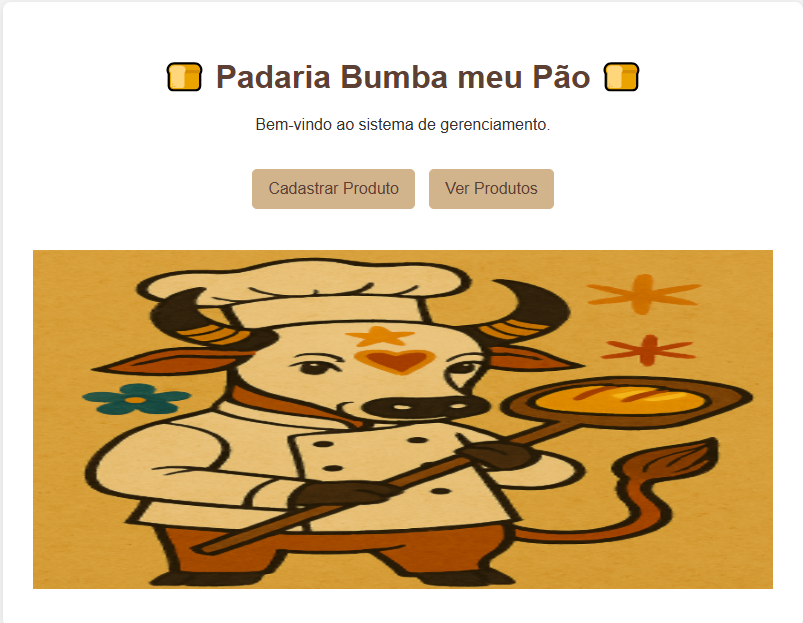
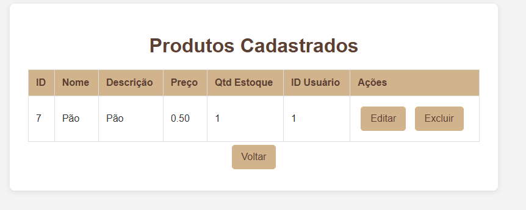
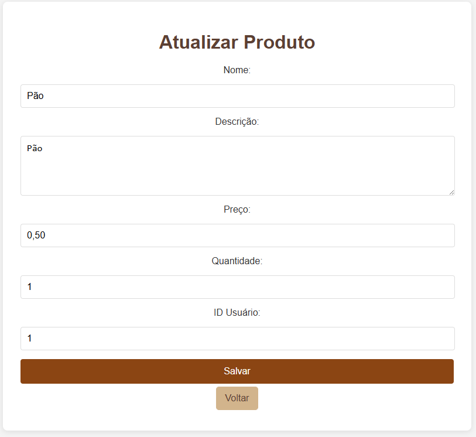
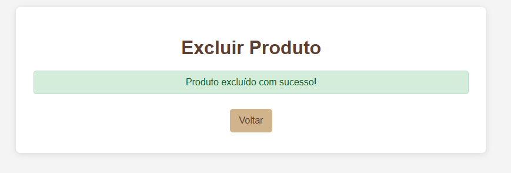

# Atividade_padaria

Explicação do Código – Sistema da Padaria Bumba Meu Pão

Esse sistema foi feito em **PHP** e **MySQL** para gerenciar **produtos** da padaria. Ele permite **cadastrar, listar, editar e excluir** produtos de forma simples e rápida.

Como o sistema funciona

1. db.php
   É o arquivo responsável por conectar o PHP ao banco de dados MySQL.
   Nele você informa:

    Host (geralmente `localhost`)
    Usuário do MySQL (padrão `root`)
    Senha (em branco no XAMPP por padrão)
    Nome do banco (`atividades padaria`)

2. index.php
   É a página inicial do sistema.
   Ela mostra dois botões:

   Cadastrar Produto → leva para a página de cadastro.
   Ver Produtos → leva para a listagem de produtos.

3. create.php
   É a página para cadastrar um novo produto.
   Contém um formulário onde você informa:

    Nome do produto
    Descrição
    Preço
    Quantidade em estoque
    ID do usuário responsável pelo produto
     Ao enviar o formulário, os dados são gravados no banco de dados.

4. read.php
   É a página que mostra todos os produtos cadastrados.
   Exibe uma tabela com:

    ID
    Nome
    Descrição
    Preço
    Quantidade
    ID do usuário responsável
     Também possui botões para Editar ou Excluir um produto.

5. update.php
   É a página para editar um produto existente.
   Ao abrir, carrega os dados atuais do produto no formulário para alteração.
   Ao salvar, atualiza o banco de dados.

6. delete.php
   É a página que remove um produto do banco de dados.
   Após excluir, redireciona para a lista de produtos.

 Fluxo de uso do sistema

1. Entre no index.php.
2. Clique em Cadastrar Produto para adicionar um novo.
3. Use Ver Produtos para listar todos.
4. Na listagem, você pode editar ou excluir qualquer produto.
5. Sempre há botões para voltar para a página anterior ou para o início.

Atividade 6- Desenvolvimento de um CRUD para Padaria
Desenvolvimento de Sistemas 
Professor: Ícaro Botelho
DS23M1
Andriel Ribeiro
Kaua Rieper Ribeiro
Arthur de Souza Farias 
Caio Poleza dos Santos

Relatório:

decisões de implementação: criar um banco de dados para a padaria onde tivemos que criar  uma pagina de bem vindo onde podemos cadastrar um produto ou ver os produtos ja cadastrados, para cadastrar um produto e preciso colocar o nome do produto a descrição o preço a quantidade do produto desejada e colocar o ID do usuario que ira cadastrar o pedido podendo editar o cadastro ou excluir em outra pagina mostra todos os cadastros de pedidos  feitos.

pontos de validação/segurança: validamos os cadastros dos pedidos nessa parte do codigo que esta em update.php onde valida o nome do produto a descrição o preço a quantidade e o id do usuario

if ($_SERVER['REQUEST_METHOD'] == 'POST') {
    $id = $_POST['id'];
    $nome = $_POST['nome'];
    $descricao = $_POST['descricao'];
    $preco = $_POST['preco'];
    $quantidade = $_POST['quantidade'];
    $id_usuario = $_POST['id_usuario'];

    $sql = "UPDATE produtos SET nome='$nome', descricao='$descricao', preco='$preco', quantidade_estoque='$quantidade', id_usuario='$id_usuario' WHERE id_produto=$id";

    if ($conn->query($sql) === TRUE) {
        $msg = "Produto atualizado com sucesso!";
        $sql = "SELECT * FROM produtos WHERE id_produto=$id";
        $result = $conn->query($sql);
        $produto = $result->fetch_assoc();
    } else {
        $msg = "Erro ao atualizar produto: " . $conn->error;
    }

screenshots
 tela inicial da padaria Bumba meu Pão

 tela de cadastro para cadastrar um produto

 tela para ver os produtos cadastrados 

 tela para editar e atualizar um produto

 tela de quando um produto e excluido 